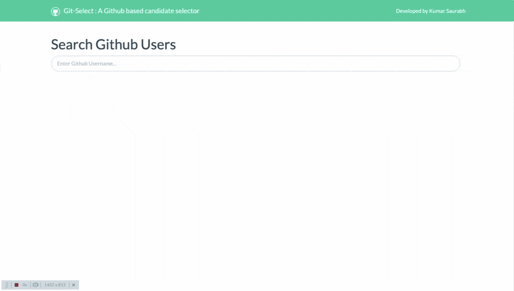

# Git-Select
Git-Select : A Github based candidate selector.
Git-Select is a JavaScript/jQuery based web application which is made to provide ease to the recruiters in their candidate selection processes. 

A Candidate selector/Recruiter has to type the Github user id of the candidate. It automatically fetches and displays Github user profile info and latest repositories using Ajax. Once the profile is loaded , the recruiter can shortlist the candidate and the information of that candidate will be saved on the database.

Servlets is used to store data into MS Access Database.

# Demo
see Demo here :  https://itsksaurabh.github.io/Git-Select/index.html

  

# Help & Support
<ul>
  <li><a href="https://in.linkedin.com/in/itsksaurabh">Author</a></li>
</ul>

